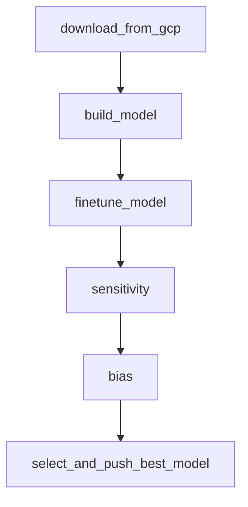

# Steam Select: Steam Game Recommendation System

## Introduction
Steam Select is a machine learning-powered game recommendation system designed to enhance user experience by providing personalized game suggestions and profitable bundle deals. Users input five of their favorite games, and the system recommends five similar games along with profitable game bundles, helping them discover new titles efficiently.

---

## Dataset Information
The dataset originates from Julian McAuley's repository but has been sampled to 25% of the original user reviews to accommodate storage and compute constraints. The dataset covers over 16,000 games with the following tables:

- **Bundle Data**: 615 rows
- **Item Metadata**: 32,100 rows
- **Reviews**: 1,100,000 rows

The dataset can be downloaded from [Hugging Face](<https://huggingface.co/datasets/PookiePooks/steam-games-dataset/tree/main>).

### Manual Download Instructions:
To manually download the dataset from Hugging Face:
1. Visit the dataset page: `<https://huggingface.co/datasets/PookiePooks/steam-games-dataset/tree/main>`
2. Click on the "Download" button.
3. Extract the dataset files and place them in the GCS bucket.


---

## Git Repository Structure
```
├── .env     <- Environment variable configuration
├── .gitignore  <- Specifies files to be ignored in version control
├── docker-compose.yaml  <- Docker configuration for running the project
├── Dockerfile  <- Defines the Docker image and dependencies
├── README.md  <- Project documentation
├── requirements.txt  <- Python dependencies
├── config/
│   ├── key.json  <- GCP service account credentials for accessing cloud storage
├── dags/  <- Airflow DAGs (Directed Acyclic Graphs) for data processing
│   ├── data_preprocessing/
│   │   ├── clean_bundle.py  
│   │   ├── clean_item.py
│   │   ├── clean_reviews.py
│   │   ├── cleanup_stage.py
│   │   ├── download_data.py
│   │   ├── EDA_bundle.py
│   │   ├── EDA_item.py
│   │   ├── EDA_reviews.py
│   │   ├── store_parquet.py
│   │   ├── write_to_gcs.py
│   ├── feature_engineering/
│   │   ├── feature_bundle.py
│   │   ├── feature_item.py
│   │   ├── feature_reviews.py
│   │   ├── merge_reviews_item.py
│   ├── visualizations/
│   │   ├── bundle  <- Bundle visualizations
│   │   ├── itemmeta  <- Item metadata visualizations
│   │   ├── reviews  <- Review visualizations
│   ├── custom_logging.py  <- Logging module
│   ├── data_cleaning_pipeline.py  <- Main DAG for data cleaning
│   ├── data_download_pipeline.py  <- DAG for downloading data
│   ├── feature_engineering_pipeline.py  <- DAG for feature engineering
│   ├── notification.py  <- Notification handling
│   ├── data_validation_pipeline.py  <- DAG for data validation
│   ├── master_data_pipeline.py  <- DAG orchestrating end-to-end pipeline
├── data/
│   ├── raw/  <- Stores raw dataset
│   ├── processed/  <- Stores processed dataset
├── [reports/](reports/Data Pipeline Report.pdf) <- Contains project report and findings
```

---

## Installation Guide

This project requires **Python 3.8 or higher** and is compatible with Windows, Linux, and macOS.

### Prerequisites
- Git
- Python >= 3.8
- Docker Daemon/Desktop (Docker must be running)

### User Installation

1. **Clone the Git Repository**
```bash
git clone https://github.com/PoojaKameshwaran/Steam-Select.git
cd steam-select
```

2. **Verify Python Version**
```bash
python --version
```

3. **Check Available Memory**
```bash
docker run --rm "debian:bullseye-slim" bash -c 'numfmt --to iec $(echo $(($(getconf _PHYS_PAGES) * $(getconf PAGE_SIZE))))'
```
If you encounter memory issues, increase Docker’s memory allocation.

4. **Modify `docker-compose.yaml` if needed**
- Set user permissions:
```yaml
user: "1000:0"
```
- Adjust SMTP settings for email notifications if not using Gmail.

5. **Add GCP Credentials**
Place your `key.json` file in `config/` to enable GCP data access.

6. **Build Docker Image**
```bash
docker compose build
```

7. **Initialize Airflow and Run the Docker Containers**
```bash
docker compose up -d
```

8. **Access Airflow Web Server**
Visit [http://localhost:8080](http://localhost:8080) and log in:
- **Username**: airflow
- **Password**: airflow

9. **Stop Docker Containers**
```bash
docker compose down
```
---

## Data Pipeline Report
[Data Pipeline Report](reports/Data%20Pipeline%20Report.pdf)


---

## Data Pipeline Workflow

### 1. **Data Collection**
- Raw dataset is downloaded from Hugging Face and uploaded to your gcs bucket.
- key.json of Airflow Service Account in GCP is placed inside config/
- Data ingestion is handled via Airflow DAGs.

### 2. **Data Validation**
- The validation pipeline ensures data integrity and consistency.
- Missing values and anomalies are identified and logged.

### 3. **Data Cleaning & Visualization**
- Cleaning scripts preprocess bundle, item metadata, and review data.
- Exploratory Data Analysis (EDA) generates insights and summary statistics.

### 4. **Feature Engineering**
- Sentiment-based scores derived from review data.
- Item metadata and reviews sentiment scores merged on Game_ID

---

## 5. Model Training

The model training pipeline is orchestrated using Airflow and is responsible for:

- **Downloading Processed Data**: The cleaned and merged datasets are fetched from GCS.
- **Model Building**: A hybrid recommender model is trained using KNN over user-item and item-user interaction matrices.
- **Hyperparameter Tuning**: Grid search over distance metrics and number of neighbors is performed to improve model performance.
- **Model Versioning**: Models are logged and versioned in MLflow with associated metrics for reproducibility and comparison.

---

## 6. Model Analysis (Bias & Sensitivity Analysis)

To ensure fairness and robustness, the pipeline includes comprehensive model analysis:

### Sensitivity Analysis
- **Purpose**: Measures how sensitive the model's predictions are to changes in input features such as hours played, sentiment scores, genres, etc.
- **Approach**: Varies key input features and evaluates how much the output changes, helping identify model dependencies.

### Bias Detection
- **Purpose**: Detects if the model performs unequally across different groups (e.g., genres or engagement levels).
- **Slicing Techniques**: Metrics like hit rate and precision are computed across slices of user engagement or genre categories.
- **Mitigation**: If bias is detected, strategies like reweighting and sampling are used.

---

## 7. Model Monitoring & Retraining

While not deployed in a production environment, the system is designed to support retraining by:

- Periodically pulling fresh review data from GCS.
- Automatically retraining the model with the latest data.
- Versioning the newly trained model in MLflow.
- Comparing performance with previously deployed models.
- Optionally pushing the best-performing model to GCS for serving.

**Future improvements include:**
- Alerts on performance degradation.
- Scheduled retraining using cron-based Airflow scheduling.
- Data drift monitoring using statistical tests.

---

## 8. Pipeline Orchestration

Airflow is used to orchestrate the complete machine learning pipeline in a modular and reproducible manner. The DAG includes:



---

## 9. Outputs

The pipeline produces several key outputs at different stages of execution:

### ✅ Trained Models
- Serialized `.pkl` files are stored after training and tuning.
- Paths:
  - `data/models/base_model/model_v1.pkl`
  - `data/models/tuned_model/tuned_model_v1.pkl`

### ✅ MLflow Artifacts
- Every training run logs:
  - Metrics (e.g., precision, recall, hit rate)
  - Parameters used (e.g., distance metric, number of neighbors)
  - Artifacts including the serialized model, source code, and environment

- Tracked in MLflow under:
  - **Experiment**: `steam_games_recommender`
  - **Model Registry**: `hybrid-recommender`
  - Automatically registered as versioned models (v1, v2, …)

### ✅ Bias & Sensitivity Reports
- Outputs from:
  - `sensitivity_analysis.py`: shows how input features like `hours`, `sentiment`, `genres` affect recommendations
  - `bias_detection.py`: evaluates model fairness across slices (e.g., genre count, playtime range)
- Reports saved as:
  - CSV or JSON summaries
  - Printed logs and visualizations

### ✅ Final Production Model
- Best-performing model is selected based on a key metric (`test_genre_precision`)
- Promoted to **Production** stage in MLflow Model Registry
- Also uploaded to GCS at: [gs://steam-select/best_models/best_model.pkl]

---

# Project Deployment and Infrastructure Setup

## Model Deployment

Follow these steps to deploy and run the application efficiently on Google Cloud Platform (GCP):

### Step 1: Install Google Component kubectl
```bash
gcloud components install kubectl
```

### Step 2: Set GCP Project
```bash
gcloud config set project poojaproject
```

### Step 3: Build Docker Image
```bash
docker build -t gcr.io/poojaproject/flask-app -f Dockerfile.flask .
```

### Step 4: Push Docker Image to Google Container Registry
```bash
docker push gcr.io/poojaproject/flask-app
```

### Step 5: Create Kubernetes Cluster
```bash
gcloud beta container --project "poojaproject" clusters create "steam-select-clusters" \
--region "us-east1" --tier "standard" --no-enable-basic-auth \
--cluster-version "1.31.6-gke.1020000" --release-channel "regular" \
--machine-type "e2-medium" --image-type "COS_CONTAINERD" \
--disk-type "pd-balanced" --disk-size "100" --metadata disable-legacy-endpoints=true \
--scopes "https://www.googleapis.com/auth/devstorage.read_only","https://www.googleapis.com/auth/logging.write","https://www.googleapis.com/auth/monitoring","https://www.googleapis.com/auth/servicecontrol","https://www.googleapis.com/auth/service.management.readonly","https://www.googleapis.com/auth/trace.append" \
--num-nodes "3" --logging=SYSTEM,WORKLOAD --monitoring=SYSTEM,STORAGE,POD,DEPLOYMENT,STATEFULSET,DAEMONSET,HPA,CADVISOR,KUBELET \
--enable-ip-alias --network "projects/poojaproject/global/networks/default" \
--subnetwork "projects/poojaproject/regions/us-east1/subnetworks/default" \
--no-enable-intra-node-visibility --default-max-pods-per-node "110" \
--enable-ip-access --security-posture=standard --workload-vulnerability-scanning=disabled \
--no-enable-google-cloud-access --addons HorizontalPodAutoscaling,HttpLoadBalancing,GcePersistentDiskCsiDriver \
--enable-autoupgrade --enable-autorepair --max-surge-upgrade 1 --max-unavailable-upgrade 0 \
--binauthz-evaluation-mode=DISABLED --enable-managed-prometheus \
--enable-shielded-nodes --shielded-integrity-monitoring --no-shielded-secure-boot \
--node-locations "us-east1-b"
```

### Step 6: Activate the Created Cluster
```bash
gcloud container clusters get-credentials steam-select-clusters --region=us-east1
```

### Step 7: Create Kubernetes Secret for Credentials
```bash
kubectl create secret generic gcp-credentials --from-file=key.json=./config/key.json
```

### Step 8: Create Disk for PostgreSQL
```bash
gcloud compute disks create postgres-disk --size=10GB --zone=us-east1-b
```

### Step 9: Deploy the Application
```bash
kubectl apply -f kubernetes/flask-app-deployment.yaml
kubectl apply -f kubernetes/flask-app-service.yaml
```

## Infrastructure Setup on GCP

### Google Kubernetes Engine (GKE)
- **Cluster Name:** steam-select-clusters
- **Region:** us-east1
- **Nodes:** 3 nodes

### IAM and Service Accounts
- **Service Account:** `airflow-gcs-access@poojaproject.iam.gserviceaccount.com`
- **Assigned Roles:**
  - Artifact Registry Writer
  - BigQuery Data Editor
  - BigQuery User
  - Kubernetes Engine Cluster Viewer
  - Kubernetes Engine Developer
  - Monitoring Metric Writer
  - Storage Admin
  - Storage Object Admin
  - Storage Object Creator

### Google Cloud Storage
- **Bucket Name:** steam-select
- **Used for:**
  - Cleaned training data
  - Trained models
  - Docker images

---

### CI/CD Pipeline

- To ensure a smooth and automated deployment experience, Steam Select is integrated with a GitHub Actions-based Continuous      Integration and Continuous Deployment (CI/CD) pipeline. The pipeline automates model building, Docker packaging, cloud storage upload, and Kubernetes deployment.

## Overview

    CI/CD Tool: GitHub Actions

    Trigger: Push to cd-pipeline branch

    Key Steps:

        Authenticate with GCP

        Set up the gcloud CLI

        Build and save Docker image

        Upload Docker image to GCS

        Get GKE credentials

        Apply Kubernetes secrets

        Deploy Kubernetes manifests

### Pipeline Code
# .github/workflows/deploy.yaml
name: GCP Kubernetes Deployment

on:
  push:
    branches:
      - cd-pipeline

jobs:
  deploy:
    runs-on: ubuntu-latest
    steps:
      - name: Checkout code
        uses: actions/checkout@v3

      - name: Authenticate to Google Cloud
        uses: google-github-actions/auth@v2
        with:
          credentials_json: ${{ secrets.gcp_key }}

      - name: Set up gcloud CLI
        uses: google-github-actions/setup-gcloud@v2
        with:
          project_id: poojaproject

      - name: Build and Save Docker Image
        run: |
          docker build -t flask-app -f Dockerfile.flask .
          docker save flask-app | gzip > flask-app.tar.gz

      - name: Upload to GCS
        run: gsutil cp flask-app.tar.gz gs://steam-select/docker-images/

      - name: Get GKE credentials
        run: gcloud container clusters get-credentials steam-select-clusters --region=us-east1

      - name: Write GCP key to file and create Kubernetes secret
        run: |
          echo "${{ secrets.gcp_key }}" > gcp-key.json
          kubectl create secret generic gcp-credentials --from-file=key.json=gcp-key.json --dry-run=client -o yaml | kubectl apply -f -


### Kubernetes Infrastructure

Steam Select is deployed using Google Kubernetes Engine (GKE) for efficient container orchestration.

## Deployment & Service Structure

# 1. flask-app-deployment.yaml:

apiVersion: apps/v1
kind: Deployment
metadata:
  name: flask-app
spec:
  replicas: 1
  selector:
    matchLabels:
      app: flask-app
  template:
    metadata:
      labels:
        app: flask-app
    spec:
      containers:
        - name: flask-app
          image: gcr.io/poojaproject/flask-app:latest
          ports:
            - containerPort: 5000
          volumeMounts:
            - name: gcp-key
              mountPath: "/secrets"
              readOnly: true
          env:
            - name: GOOGLE_APPLICATION_CREDENTIALS
              value: "/secrets/key.json"
      volumes:
        - name: gcp-key
          secret:
            secretName: gcp-credentials

# 2. flask-app-service.yaml:
apiVersion: v1
kind: Service
metadata:
  name: flask-app-service
spec:
  selector:
    app: flask-app
  ports:
    - protocol: TCP
      port: 80
      targetPort: 5000
  type: LoadBalancer

# 3. airflow.yaml: Deploys Apache Airflow using a similar setup for DAG orchestration.

    Web UI exposed on port 8080

    Deployed on same GKE cluster


Here's a clean and well-formatted version of your content tailored for a `README.md` on GitHub. It's structured using Markdown with headers, bullet points, and code snippets where appropriate:

---

# 🎮 Flask UI + Monitoring for Game Recommendation System

## 🌐 Flask API - UI Page

The user interface of our application is built using **Flask** and served on port `5000`. Once deployed behind a **Load Balancer**, the interface allows users to:

1. Enter their **top 3 favorite games**.

2. Click **"Get Recommendations"** to receive **top 3 game suggestions**.


3. View recommendations directly on the UI.

4. Provide **feedback** on each recommended game.


---

## 📊 Logging and Monitoring

We implemented a logging and monitoring pipeline using **BigQuery** and **Google Cloud Monitoring** to track input features, predictions, and system performance.

### 🔧 BigQuery

**BigQuery** serves as the central logging repository for user inputs and model predictions.

#### Setup Instructions:

1. **Create Dataset:**
   - Go to [Google Cloud Console](https://console.cloud.google.com/).
   - Navigate to **BigQuery**.
   - Create a new dataset named `recommendation_metrics`.

2. **Create Table:**
   - Under `recommendation_metrics`, create a table named `user_feedback`.
   - Use the schema below:
     ```json
     [
       {"name": "timestamp", "type": "timestamp", "mode": "NULLABLE"},
       {"name": "game_ids", "type": "STRING", "mode": "NULLABLE"},
       {"name": "ratings", "type": "STRING", "mode": "NULLABLE"},
       {"name": "avg_ratings", "type": "FLOAT", "mode": "NULLABLE"}
     ]
     ```
     
3. **Add Permissions:**
   - Go to **IAM & Admin**.
   - Edit the appropriate service account.
   - Add the following roles:
     - `BigQuery Data Editor`
     - `BigQuery Data Viewer`
     - `BigQuery User`
     - `Storage Object Viewer`
     - `Editor`

Once completed, predictions and metadata are automatically logged to BigQuery upon every recommendation request.


---

### 📈 Google Cloud Monitoring

**Google Cloud Monitoring** provides observability into the system's health, prediction performance, and user engagement.

#### Use Cases:

- Track **API response times** and system health
- Monitor **model decay** and prediction anomalies
- Log user feedback and metrics for debugging

#### Setup Instructions:

1. Open **Google Cloud Monitoring Console**.
2. Create a **Workspace** and link it with your project.
3. Use **Metrics Explorer** to:
   - Visualize latency and system health
   - Track key metrics over time
4. Set up **Alert Policies** to get notified about anomalies (e.g., high latency or failed predictions)

---

## 📊 Monitoring Dashboard Features

### 🧠 Model Performance

- Shows **Precision & Recall** for training and testing datasets
- Includes gauges to quickly evaluate **model reliability**

### 💬 User Feedback

- Tracks **average user rating trends**
- Monitors **daily feedback volume** for engagement analysis

### 📈 Performance Trends

- Visualizes **precision and recall** over time
- Helps detect **model drift** and quality changes

  


---


## ✅ Conclusion

We developed a **hybrid game recommendation system** with a clean UI and integrated monitoring for performance insights. The combination of **Flask**, **BigQuery**, and **Google Cloud Monitoring** ensures:

- Accurate predictions
- High user satisfaction
- Scalable performance tracking

🔮 **Future Enhancements:**  
We plan to integrate a **chatbot interface** for a more conversational recommendation experience.

---

