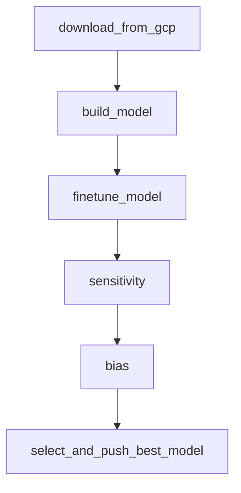

# Steam Select: Steam Game Recommendation System

## Introduction
Steam Select is a machine learning-powered game recommendation system designed to enhance user experience by providing personalized game suggestions and profitable bundle deals. Users input five of their favorite games, and the system recommends five similar games along with profitable game bundles, helping them discover new titles efficiently.

---

## Dataset Information
The dataset originates from Julian McAuley's repository but has been sampled to 25% of the original user reviews to accommodate storage and compute constraints. The dataset covers over 16,000 games with the following tables:

- **Bundle Data**: 615 rows
- **Item Metadata**: 32,100 rows
- **Reviews**: 1,100,000 rows

The dataset can be downloaded from [Hugging Face](<https://huggingface.co/datasets/PookiePooks/steam-games-dataset/tree/main>).

### Manual Download Instructions:
To manually download the dataset from Hugging Face:
1. Visit the dataset page: `<https://huggingface.co/datasets/PookiePooks/steam-games-dataset/tree/main>`
2. Click on the "Download" button.
3. Extract the dataset files and place them in the GCS bucket.


---

## Git Repository Structure
```
├── .env     <- Environment variable configuration
├── .gitignore  <- Specifies files to be ignored in version control
├── docker-compose.yaml  <- Docker configuration for running the project
├── Dockerfile  <- Defines the Docker image and dependencies
├── README.md  <- Project documentation
├── requirements.txt  <- Python dependencies
├── config/
│   ├── key.json  <- GCP service account credentials for accessing cloud storage
├── dags/  <- Airflow DAGs (Directed Acyclic Graphs) for data processing
│   ├── data_preprocessing/
│   │   ├── clean_bundle.py  
│   │   ├── clean_item.py
│   │   ├── clean_reviews.py
│   │   ├── cleanup_stage.py
│   │   ├── download_data.py
│   │   ├── EDA_bundle.py
│   │   ├── EDA_item.py
│   │   ├── EDA_reviews.py
│   │   ├── store_parquet.py
│   │   ├── write_to_gcs.py
│   ├── feature_engineering/
│   │   ├── feature_bundle.py
│   │   ├── feature_item.py
│   │   ├── feature_reviews.py
│   │   ├── merge_reviews_item.py
│   ├── visualizations/
│   │   ├── bundle  <- Bundle visualizations
│   │   ├── itemmeta  <- Item metadata visualizations
│   │   ├── reviews  <- Review visualizations
│   ├── custom_logging.py  <- Logging module
│   ├── data_cleaning_pipeline.py  <- Main DAG for data cleaning
│   ├── data_download_pipeline.py  <- DAG for downloading data
│   ├── feature_engineering_pipeline.py  <- DAG for feature engineering
│   ├── notification.py  <- Notification handling
│   ├── data_validation_pipeline.py  <- DAG for data validation
│   ├── master_data_pipeline.py  <- DAG orchestrating end-to-end pipeline
├── data/
│   ├── raw/  <- Stores raw dataset
│   ├── processed/  <- Stores processed dataset
├── [reports/](reports/Data Pipeline Report.pdf) <- Contains project report and findings
```

---

## Installation Guide

This project requires **Python 3.8 or higher** and is compatible with Windows, Linux, and macOS.

### Prerequisites
- Git
- Python >= 3.8
- Docker Daemon/Desktop (Docker must be running)

### User Installation

1. **Clone the Git Repository**
```bash
git clone https://github.com/PoojaKameshwaran/Steam-Select.git
cd steam-select
```

2. **Verify Python Version**
```bash
python --version
```

3. **Check Available Memory**
```bash
docker run --rm "debian:bullseye-slim" bash -c 'numfmt --to iec $(echo $(($(getconf _PHYS_PAGES) * $(getconf PAGE_SIZE))))'
```
If you encounter memory issues, increase Docker’s memory allocation.

4. **Modify `docker-compose.yaml` if needed**
- Set user permissions:
```yaml
user: "1000:0"
```
- Adjust SMTP settings for email notifications if not using Gmail.

5. **Add GCP Credentials**
Place your `key.json` file in `config/` to enable GCP data access.

6. **Build Docker Image**
```bash
docker compose build
```

7. **Initialize Airflow and Run the Docker Containers**
```bash
docker compose up -d
```

8. **Access Airflow Web Server**
Visit [http://localhost:8080](http://localhost:8080) and log in:
- **Username**: airflow
- **Password**: airflow

9. **Stop Docker Containers**
```bash
docker compose down
```
---

## Data Pipeline Report
[Data Pipeline Report](reports/Data%20Pipeline%20Report.pdf)


---

## Data Pipeline Workflow

### 1. **Data Collection**
- Raw dataset is downloaded from Hugging Face and uploaded to your gcs bucket.
- key.json of Airflow Service Account in GCP is placed inside config/
- Data ingestion is handled via Airflow DAGs.

### 2. **Data Validation**
- The validation pipeline ensures data integrity and consistency.
- Missing values and anomalies are identified and logged.

### 3. **Data Cleaning & Visualization**
- Cleaning scripts preprocess bundle, item metadata, and review data.
- Exploratory Data Analysis (EDA) generates insights and summary statistics.

### 4. **Feature Engineering**
- Sentiment-based scores derived from review data.
- Item metadata and reviews sentiment scores merged on Game_ID

---

## 5. Model Training

The model training pipeline is orchestrated using Airflow and is responsible for:

- **Downloading Processed Data**: The cleaned and merged datasets are fetched from GCS.
- **Model Building**: A hybrid recommender model is trained using KNN over user-item and item-user interaction matrices.
- **Hyperparameter Tuning**: Grid search over distance metrics and number of neighbors is performed to improve model performance.
- **Model Versioning**: Models are logged and versioned in MLflow with associated metrics for reproducibility and comparison.

---

## 6. Model Analysis (Bias & Sensitivity Analysis)

To ensure fairness and robustness, the pipeline includes comprehensive model analysis:

### Sensitivity Analysis
- **Purpose**: Measures how sensitive the model's predictions are to changes in input features such as hours played, sentiment scores, genres, etc.
- **Approach**: Varies key input features and evaluates how much the output changes, helping identify model dependencies.

### Bias Detection
- **Purpose**: Detects if the model performs unequally across different groups (e.g., genres or engagement levels).
- **Slicing Techniques**: Metrics like hit rate and precision are computed across slices of user engagement or genre categories.
- **Mitigation**: If bias is detected, strategies like reweighting and sampling are used.

---

## 7. Model Monitoring & Retraining

While not deployed in a production environment, the system is designed to support retraining by:

- Periodically pulling fresh review data from GCS.
- Automatically retraining the model with the latest data.
- Versioning the newly trained model in MLflow.
- Comparing performance with previously deployed models.
- Optionally pushing the best-performing model to GCS for serving.

**Future improvements include:**
- Alerts on performance degradation.
- Scheduled retraining using cron-based Airflow scheduling.
- Data drift monitoring using statistical tests.

---

## 8. Pipeline Orchestration

Airflow is used to orchestrate the complete machine learning pipeline in a modular and reproducible manner. The DAG includes:



---

## 9. Outputs

The pipeline produces several key outputs at different stages of execution:

### ✅ Trained Models
- Serialized `.pkl` files are stored after training and tuning.
- Paths:
  - `data/models/base_model/model_v1.pkl`
  - `data/models/tuned_model/tuned_model_v1.pkl`

### ✅ MLflow Artifacts
- Every training run logs:
  - Metrics (e.g., precision, recall, hit rate)
  - Parameters used (e.g., distance metric, number of neighbors)
  - Artifacts including the serialized model, source code, and environment

- Tracked in MLflow under:
  - **Experiment**: `steam_games_recommender`
  - **Model Registry**: `hybrid-recommender`
  - Automatically registered as versioned models (v1, v2, …)

### ✅ Bias & Sensitivity Reports
- Outputs from:
  - `sensitivity_analysis.py`: shows how input features like `hours`, `sentiment`, `genres` affect recommendations
  - `bias_detection.py`: evaluates model fairness across slices (e.g., genre count, playtime range)
- Reports saved as:
  - CSV or JSON summaries
  - Printed logs and visualizations

### ✅ Final Production Model
- Best-performing model is selected based on a key metric (`test_genre_precision`)
- Promoted to **Production** stage in MLflow Model Registry
- Also uploaded to GCS at: [gs://steam-select/best_models/best_model.pkl]

---
